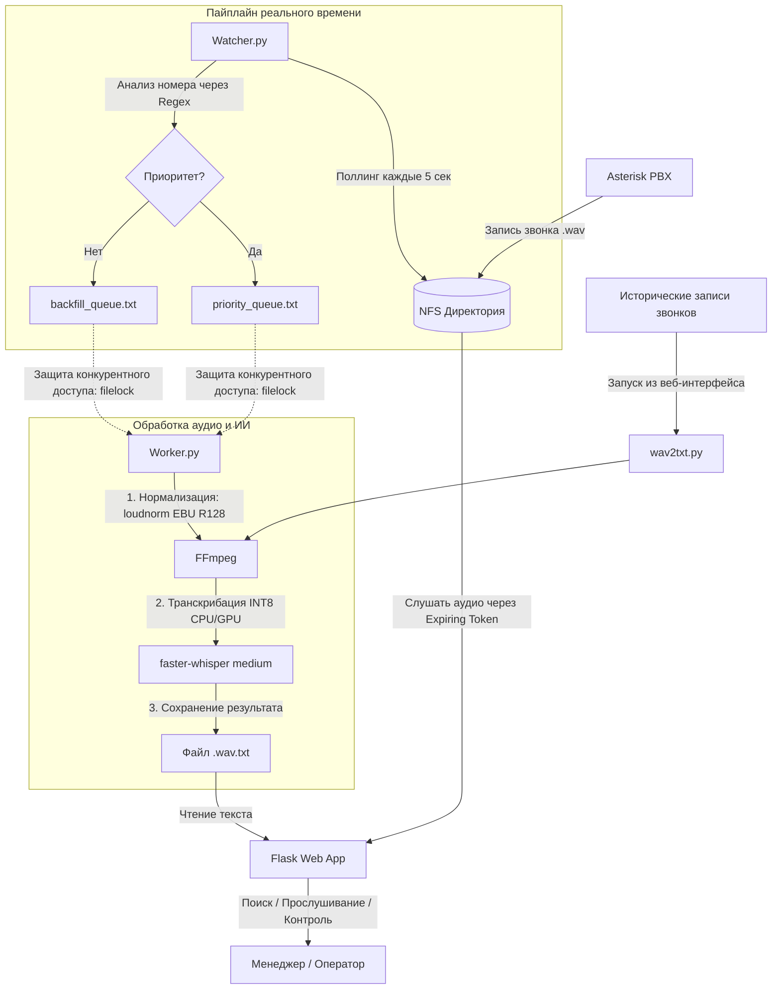

```mermaid
graph TD
    %% Компоненты телефонии и хранилища
    A[Asterisk PBX] -->|Запись звонка .wav| B[(NFS Директория)]
    
    %% Демон отслеживания
    subgraph Real-Time Pipeline [Пайплайн реального времени]
        C[Watcher.py] -->|Поллинг каждые 5 сек| B
        C -->|Анализ номера через Regex| D{Приоритет?}
        D -->|Да| E[priority_queue.txt]
        D -->|Нет| F[backfill_queue.txt]
    end
    
    %% Блокировки и обработка
    E & F -.->|Защита конкурентного доступа: filelock| G[Worker.py]
    
    %% Пайплайн обработки аудио
    subgraph Audio & ML Processing [Обработка аудио и ИИ]
        G -->|1. Нормализация: loudnorm EBU R128| H[FFmpeg]
        H -->|2. Транскрибация INT8 CPU/GPU| I[faster-whisper medium]
        I -->|3. Сохранение результата| J[Файл .wav.txt]
    end
    
    %% Веб-интерфейс и пользователи
    J -->|Чтение текста| K[Flask Web App]
    B -->|Слушать аудио через Expiring Token| K
    K -->|Поиск / Прослушивание / Контроль| L[Менеджер / Оператор]
    
    %% Пакетный режим
    M[Исторические записи звонков] -->|Запуск из веб-интерфейса| N[wav2txt.py]
    N --> H
```
